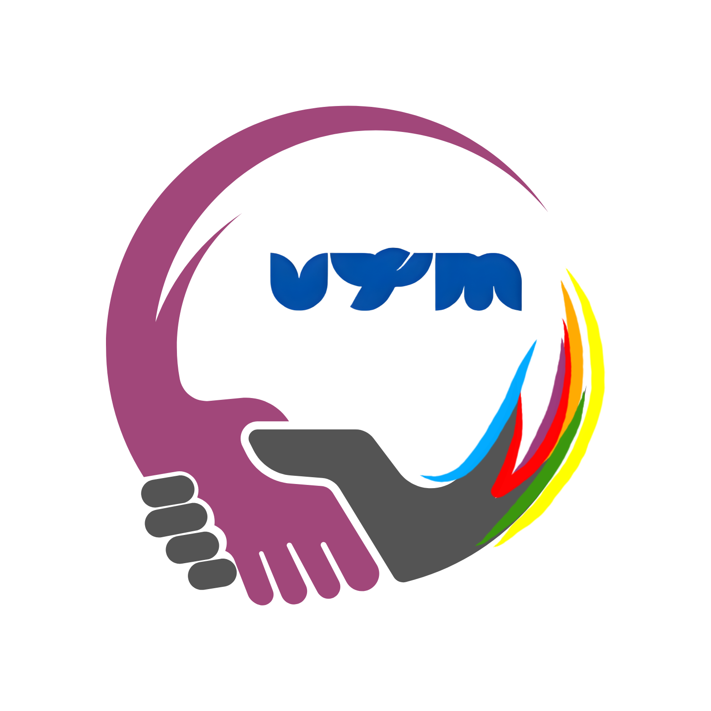

<div align="center">
<table border="0" cellspacing="0" cellpadding="0">
  <tr>
    <td align="center">
      
    </td>
    <td align="center">
      
    </td>
  </tr>
</table>

<div align="center">
    
    
    
    
</div>

</div>

Selamat datang di repositori resmi **Portal UPA-BK UTM**. Platform ini dirancang untuk mempermudah akses mahasiswa terhadap layanan bimbingan dan konseling psikologis dengan antarmuka modern, interaktif, dan ramah pengguna yang mengusung desain estetika *premium glassmorphism*.

> Ruang aman untuk bercerita, tumbuh, dan pulih bagi mahasiswa Universitas Trunojoyo Madura (UTM).


## ✨ Fitur Utama


- 📅 **Pendaftaran Konseling Terintegrasi**  
  Alur pendaftaran yang aman dan mulus, terintegrasi langsung dengan formulir resmi Google Forms UPA-BK.

- 📚 **Artikel & Edukasi Kesehatan Mental**  
  Kumpulan artikel responsif yang siap membantu mahasiswa dalam edukasi diri dan penjagaan kesehatan mental.

- 💬 **Pusat Bantuan & FAQ**  
  Informasi lengkap seputar alur layanan konseling, tanya jawab seputar isu psikologis, serta *chatbot* bantuan.

- 🎨 **Modern Premium UI/UX Design**  
  Antarmuka dinamis (*smooth animations*), efek tembus pandang kaca (*glassmorphism*), responsivitas layar, serta tata letak profesional kelas enterprise.

<br clear="right"/>


## 🚀 Panduan Menjalankan Proyek di Komputer Lokal

Proyek ini dibangun menggunakan ekosistem modern ([Vite](https://vitejs.dev/) + [React](https://reactjs.org/) + [TypeScript](https://www.typescriptlang.org/)). Ikuti langkah-langkah di bawah ini untuk menjalankannya secara lokal:

### Prasyarat
Pastikan perangkat Anda sudah terinstal:
- [Node.js](https://nodejs.org/) (Sangat disarankan menggunakan Versi 18 atau ke atas)
- Git & *Package manager* (NPM, Yarn, atau PNPM)

### Langkah Instalasi

1. **Clone repositori ini ke komputer Anda**
   ```bash
   git clone https://github.com/Renoslendra/project-upabkutm.git
   cd project-upabkutm
   ```

2. **Instal dependensi (*dependencies*)**
   ```bash
   npm install
   ```

3. **Jalankan server pengembangan lokal (*development server*)**
   ```bash
   npm run dev
   ```

4. Akses aplikasi:  
   Buka *browser* Anda dan kunjungi tautan lokal yang diberikan di terminal (biasanya berada di `http://localhost:5173/`).


## 🛠️ Teknologi yang Digunakan


| Kategori | Teknologi |
|----------|-----------|
| 🖼️ **Frontend Framework** | React 18 |
| ⚡ **Build Tool** | Vite |
| 🔷 **Bahasa Pemrograman** | TypeScript |
| 🎨 **Styling** | Tailwind CSS (dengan kustomisasi ekstensi *utility* desain sistem) |
| 🔀 **Routing** | React Router v6 |
| 🎯 **Icons** | Lucide React |

<br clear="right"/>


## 📞 Kontak & Dukungan Layanan


| Info | Detail |
|------|--------|
| 📍 **Lokasi** | Gedung UPA-BK, Jl. Raya Telang, Bangkalan, Madura |
| 📧 **Email** | upabk@trunojoyo.ac.id |
| 📞 **Telepon** | (031) 3011146 |
| 🕐 **Jam Buka** | Senin - Jumat (08:00 - 16:00 WIB) |

<br clear="right"/>

<a href="https://www.youtube.com/watch?v=dQw4w9WgXcQ"></a>


## <picture></picture> Development Team

Tim pengembang **Portal UPA-BK UTM** berasal dari Program Studi **Teknik Informatika**, **Fakultas Teknik**, **Universitas Trunojoyo Madura**.
 
<br/>
<table border="0" cellspacing="0" cellpadding="16">
  <tr>
    <td align="center">
      
      <br/><br/>
      <b>A. Choiril Anwar El-A.R</b>
      <br/>
      <sub>240411100098</sub>
      <br/>
      <sub>🎨 Front End</sub>
    </td>
    <td align="center">
      
      <br/><br/>
      <b>Rifqi Fairurrafi</b>
      <br/>
      <sub>240411100201</sub>
      <br/>
      <sub>🎨 Front End</sub>
    </td>
    <td align="center">
      
      <br/><br/>
      <b>Reno Syaelendra</b>
      <br/>
      <sub>240411100020</sub>
      <br/>
      <sub>⚙️ Back End</sub>
    </td>
    <td align="center">
      
      <br/><br/>
      <b>Firdausi Nuzula</b>
      <br/>
      <sub>240411100191</sub>
      <br/>
      <sub>⚙️ Back End</sub>
    </td>
  </tr>
</table>
</div>
<p align="center">
  <br>
  <i>© 2026 UPA-BK Universitas Trunojoyo Madura. Dibuat dengan dedikasi untuk kesejahteraan mental mahasiswa.</i>
</p>